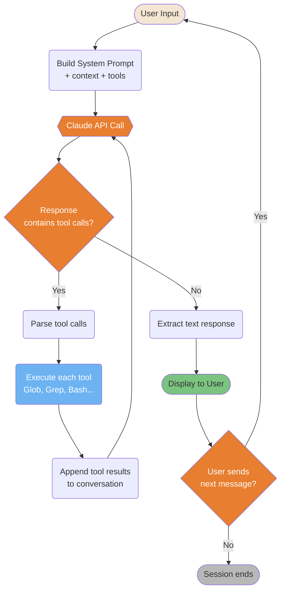
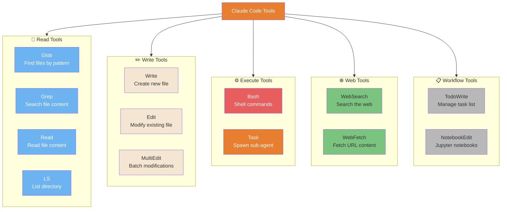
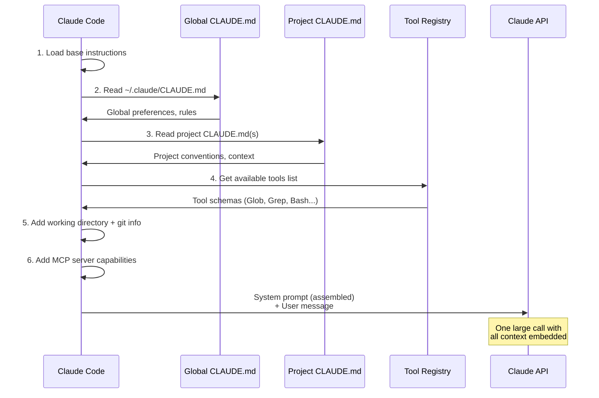
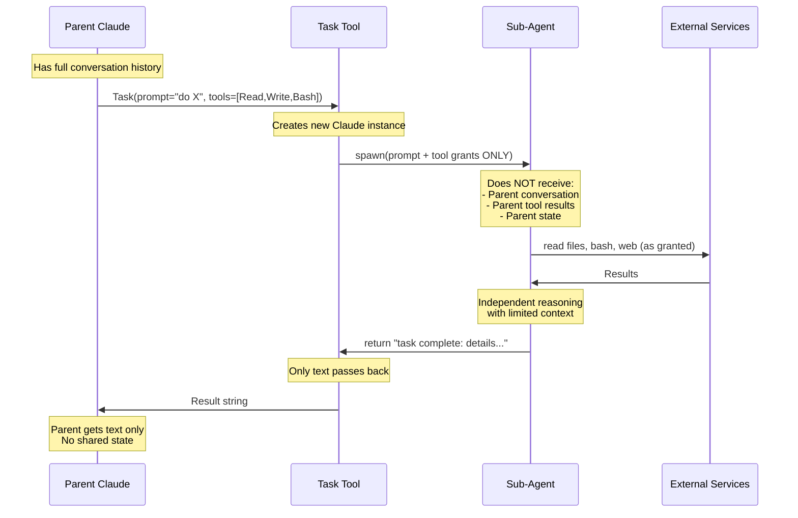

# Architecture Internals

What happens under the hood when Claude Code runs.

---

### The Master Loop

Claude Code's core execution is a single loop: parse → build prompt → call API → execute tools → loop until done. The agentic behavior emerges from this simple cycle.



<details>
<summary>ASCII version</summary>

```
User Input
     │
Build prompt (system + context + tools)
     │
 Claude API ◄────────────────────────┐
     │                               │
Tool calls?                          │
 ├─ Yes → Execute tools → Append results ──┘
 └─ No  → Display response
               │
         User next msg? ──► Yes → loop
               └─ No → Session ends
```

</details>

> **Source**: [Architecture: Master Loop](../architecture.md#master-loop) — Line ~72

---

### Tool Categories & Selection

Claude Code has 5 tool categories, each optimized for different operations. Understanding which tool Claude chooses (and why) helps you write instructions that guide better tool selection.



<details>
<summary>ASCII version</summary>

```
READ:     Glob (find), Grep (search), Read (content), LS (list)
WRITE:    Write (create), Edit (modify), MultiEdit (batch)
EXECUTE:  Bash (shell), Task (sub-agent)  ← most powerful/risky
WEB:      WebSearch, WebFetch
WORKFLOW: TodoWrite, NotebookEdit
```

</details>

> **Source**: [Architecture: Tools](../architecture.md#tools) — Line ~213

---

### System Prompt Assembly

Before every API call, Claude Code assembles a system prompt from multiple sources in a specific order. This explains why your CLAUDE.md instructions actually work and where they appear.



<details>
<summary>ASCII version</summary>

```
System prompt assembly order:
1. Base instructions (hardcoded)
2. ~/.claude/CLAUDE.md
3. /project/CLAUDE.md + subdirs
4. Tool definitions list
5. Working directory + git status
6. MCP server capabilities
──────────────────────────────────
→ All combined → Claude API call
```

</details>

> **Source**: [Architecture: System Prompt](../architecture.md#system-prompt) — Line ~354

---

### Sub-Agent Context Isolation

Sub-agents are completely isolated from the parent — they can't read the parent's conversation or modify parent state. This isolation is a feature (safety) and a constraint (intentional design).



<details>
<summary>ASCII version</summary>

```
Parent (full context)
    │
    Task(prompt, tools=[...])
    │
    ▼
Sub-Agent (ISOLATED)
  Input: prompt + tool grants only
  Can: use granted tools independently
  Cannot: see parent conversation, modify parent state
  Output: text result ONLY
    │
    ▼
Parent receives: text string
```

</details>

> **Source**: [Architecture: Sub-Agents](../architecture.md#sub-agents) — Line ~444
