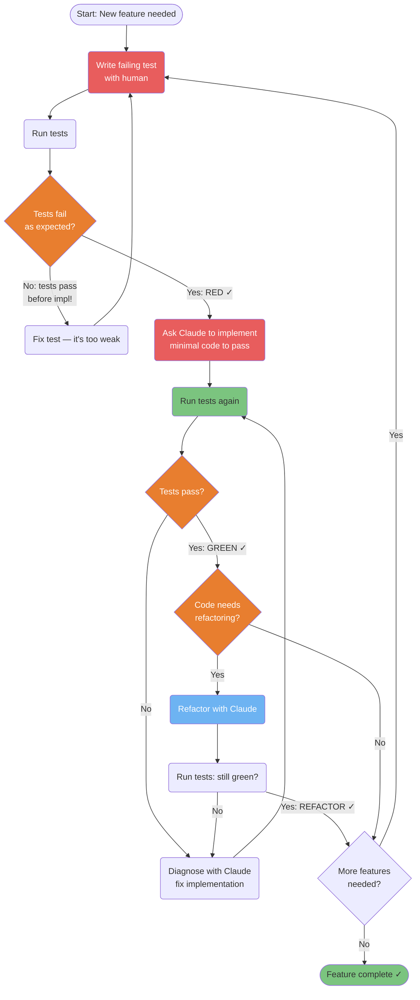
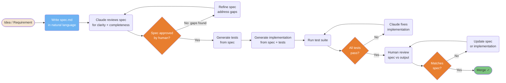
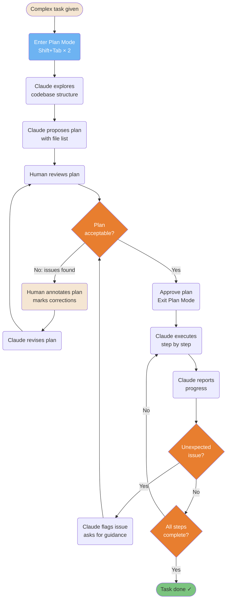
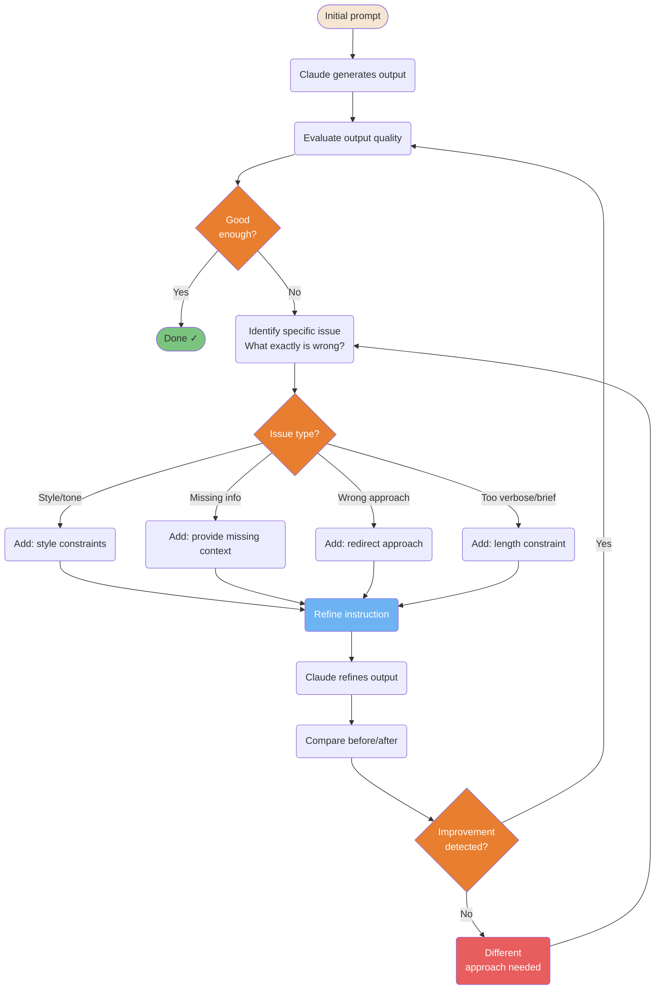

# Development Workflows

Proven patterns for structuring AI-assisted development sessions.

---

### TDD Red-Green-Refactor with Claude

Test-Driven Development adapted for Claude Code: write the failing test first, then ask Claude to implement only what's needed to pass it. This prevents over-engineering and ensures tests actually verify behavior.



<details>
<summary>ASCII version</summary>

```
Write failing test (RED)
        │
    Run tests
        │
  Fail as expected?
  ├─ No  → Fix test (too weak)
  └─ Yes → Ask Claude: implement minimal code
                │
           Run tests
                │
           Pass? (GREEN)
           ├─ No  → Diagnose + fix
           └─ Yes → Refactor?
                    ├─ Yes → Refactor (REFACTOR) → re-run tests
                    └─ No  → Next feature
```

</details>

> **Source**: [TDD with Claude](../workflows/tdd-with-claude.md)

---

### Spec-First Development Pipeline

Write the specification before the code. Claude uses the spec as the single source of truth — preventing drift between what was planned and what was built.



<details>
<summary>ASCII version</summary>

```
Idea → Write spec.md → Claude reviews
                             │
                       Approved? ─No→ Refine spec
                             │ Yes
                       Generate tests from spec
                             │
                       Generate implementation
                             │
                       Run tests → Pass? ─No→ Claude fixes
                             │ Yes
                       Human review → Matches spec? ─No→ Fix
                             │ Yes
                           Merge ✓
```

</details>

> **Source**: [Spec-First Development](../workflows/spec-first.md)

---

### Plan-Driven Workflow with Annotation

Complex tasks benefit from plan mode: Claude explores the codebase, proposes a plan, you annotate it, then Claude executes only what was approved. Prevents surprises on large refactors.



<details>
<summary>ASCII version</summary>

```
Complex task
     │
Plan Mode (Shift+Tab×2)
     │
Claude explores codebase
     │
Claude proposes plan
     │
Human reviews ──No──► Annotate + Claude revises ──► re-review
     │ Yes
Approve + exit plan mode
     │
Claude executes step by step
     │
Unexpected? ──Yes──► Flag + ask guidance
     │ No
Done? ──No──► continue
     │ Yes
Complete ✓
```

</details>

> **Source**: [Plan-Driven Workflow](../workflows/plan-driven.md)

---

### Iterative Refinement Loop

Output rarely hits the mark on the first try. This loop gives you a systematic way to improve results through targeted feedback rather than "make it better" vague instructions.



<details>
<summary>ASCII version</summary>

```
Prompt → Output → Evaluate → Good? ──Yes──► Done
                                 │ No
                          Identify specific issue
                                 │
                          ┌──────┴──────────────┐
                         Style  Missing  Wrong  Length
                          └──────┬──────────────┘
                          Refine instruction
                                 │
                          Claude refines
                                 │
                          Better? ──Yes──► Evaluate again
                                 │ No
                          Different approach
```

</details>

> **Source**: [Iterative Refinement](../workflows/iterative-refinement.md) — Line ~347
