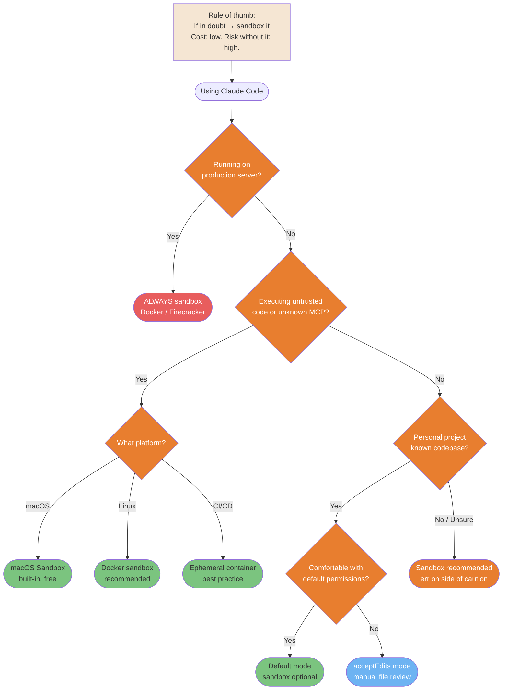
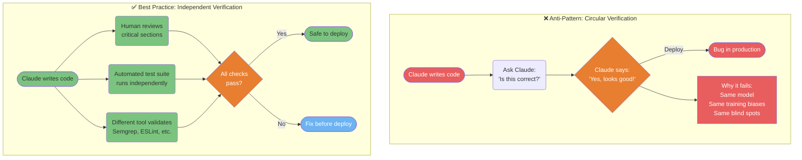

# Security & Production

Patterns for safely running Claude Code in sensitive and production environments.

---

### Security 3-Layer Defense Model

Defense in depth for Claude Code: prevention stops most threats, detection catches what slips through, and response limits blast radius. No single layer is sufficient.

```mermaid
flowchart LR
    THREAT([Threat / Attack]) --> L1

    subgraph L1["🛡️ Layer 1: Prevention"]
        P1[MCP server vetting<br/>read source before install]
        P2[CLAUDE.md restrictions<br/>define forbidden actions]
        P3[.claudeignore<br/>hide sensitive files]
        P4[Minimal permissions<br/>bypassPermissions only in CI]
    end

    subgraph L2["🔍 Layer 2: Detection"]
        D1[PreToolUse hooks<br/>log all tool calls]
        D2[Audit logs<br/>complete history]
        D3[Anomaly alerts<br/>unexpected file access]
    end

    subgraph L3["🔒 Layer 3: Response"]
        R1[Sandbox isolation<br/>Docker / Firecracker]
        R2[Permission gates<br/>human approval on risk]
        R3[Rollback capability<br/>git revert, backups]
    end

    L1 -->|Bypassed| L2
    L2 -->|Bypassed| L3
    L3 --> BLOCKED([Threat contained])

    style THREAT fill:#E85D5D,color:#fff
    style P1 fill:#7BC47F,color:#333
    style P2 fill:#7BC47F,color:#333
    style P3 fill:#7BC47F,color:#333
    style P4 fill:#7BC47F,color:#333
    style D1 fill:#6DB3F2,color:#fff
    style D2 fill:#6DB3F2,color:#fff
    style D3 fill:#6DB3F2,color:#fff
    style R1 fill:#E87E2F,color:#fff
    style R2 fill:#E87E2F,color:#fff
    style R3 fill:#E87E2F,color:#fff
    style BLOCKED fill:#7BC47F,color:#333
```



<details>
<summary>ASCII version</summary>

```
Threat
  │
Layer 1: PREVENTION
  - MCP vetting + CLAUDE.md restrictions + .claudeignore
  │ (bypassed) →
Layer 2: DETECTION
  - Hooks logging + audit logs + anomaly alerts
  │ (bypassed) →
Layer 3: RESPONSE
  - Sandbox + permission gates + rollback
  │
Contained
```

</details>

> **Source**: [Security Hardening](../security-hardening.md) — Full guide

---

### Sandbox Decision Tree

Sandboxing adds overhead. Use this tree to decide when it's mandatory, recommended, or optional for your situation.



<details>
<summary>ASCII version</summary>

```
Production server? → YES → ALWAYS sandbox (Docker/Firecracker)
     │ No
Untrusted code or unknown MCP?
  ├─ Yes → macOS sandbox / Docker / ephemeral container
  └─ No  → Personal project with known codebase?
            ├─ Yes → Default or acceptEdits (sandbox optional)
            └─ No  → Sandbox recommended

Rule: When in doubt, sandbox it.
```

</details>

> **Source**: [Sandbox Native](../sandbox-native.md) — Line ~512

---

### The Verification Paradox

Asking Claude to verify its own work is circular. The same model that produced the bug will often miss it during review. This anti-pattern causes production incidents.



<details>
<summary>ASCII version</summary>

```
BAD: Claude writes → Claude checks → "Looks good" → Deploy → Bug
     (same model, same biases, circular)

GOOD: Claude writes → Human reviews (critical sections)
                    → Automated tests (independent)
                    → Static analysis (different tool)
                    → All pass? → Deploy ✓
```

</details>

> **Source**: [Production Safety](../production-safety.md) — Line ~639

---

### CI/CD Integration Pipeline

Claude Code can run in non-interactive mode inside CI/CD pipelines for automated code review, documentation, and quality checks on every PR.

```mermaid
flowchart LR
    PR([PR Created]) --> GH{GitHub Actions<br/>trigger}
    GH --> ENV[Set up environment<br/>ANTHROPIC_API_KEY secret]
    ENV --> CC[claude --print --headless<br/>'Run quality checks']

    CC --> subgraph TASKS["Parallel Checks"]
        T1[Lint check<br/>ESLint / Prettier]
        T2[Test suite<br/>Vitest / Jest]
        T3[Security scan<br/>Semgrep MCP]
        T4[Doc completeness<br/>check exports]
    end

    T1 & T2 & T3 & T4 --> AGG{All<br/>checks pass?}
    AGG -->|Yes| OK([✓ Checks green<br/>human review next])
    AGG -->|No| FAIL([✗ Report failures<br/>on PR])
    FAIL --> FIX([Developer fixes<br/>re-trigger CI])
    FIX --> CC

    style PR fill:#F5E6D3,color:#333
    style GH fill:#B8B8B8,color:#333
    style CC fill:#E87E2F,color:#fff
    style T1 fill:#6DB3F2,color:#fff
    style T2 fill:#6DB3F2,color:#fff
    style T3 fill:#6DB3F2,color:#fff
    style T4 fill:#6DB3F2,color:#fff
    style AGG fill:#E87E2F,color:#fff
    style OK fill:#7BC47F,color:#333
    style FAIL fill:#E85D5D,color:#fff
    style FIX fill:#F5E6D3,color:#333
```

<details>
<summary>ASCII version</summary>

```
PR created → GitHub Actions → setup ANTHROPIC_API_KEY
                                    │
                          claude --print --headless
                                    │
                    ┌───────────────┼────────────────┐
                   Lint           Tests           Security
                                    │
                          All pass? ──No──► Fail PR + report
                            │ Yes
                          ✓ Green → human review → merge
```

</details>

> **Source**: [CI/CD Integration](../ultimate-guide.md#cicd-integration) — Line ~6835
