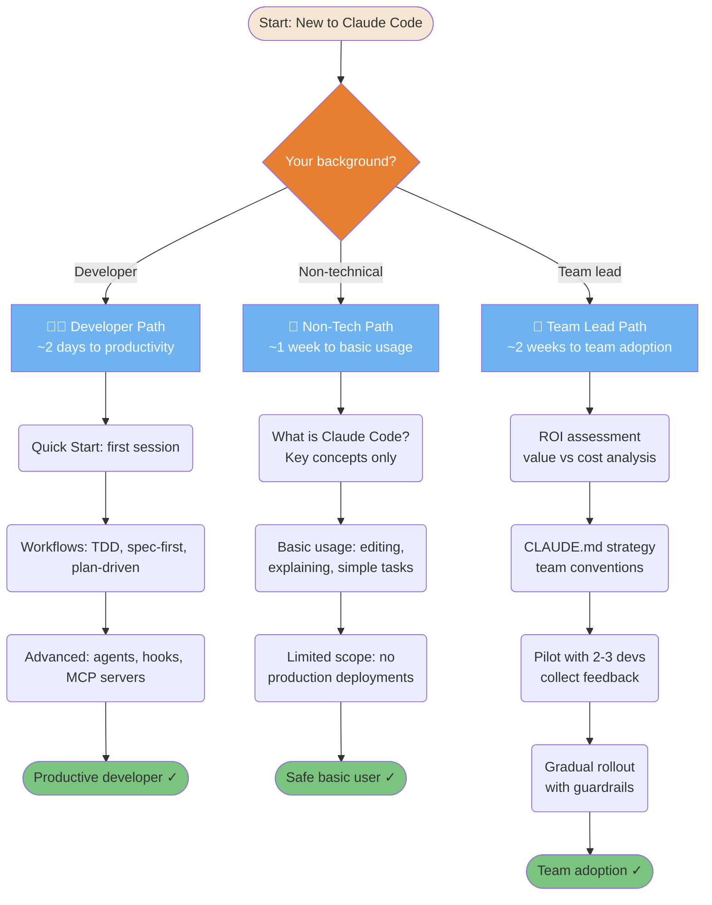
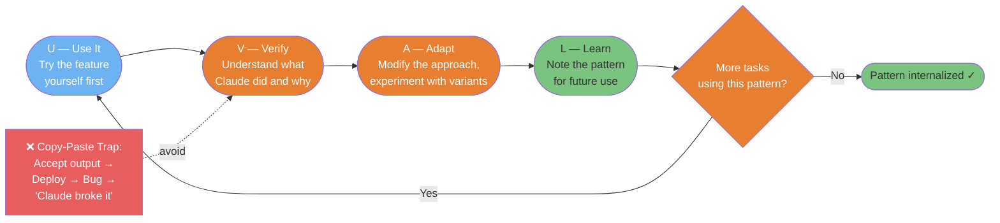
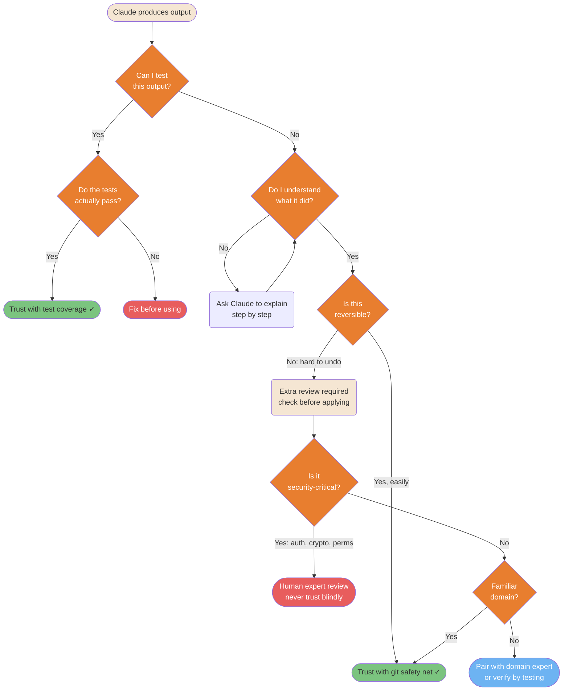

# Adoption & Learning

How individuals and teams successfully adopt Claude Code without losing skills or control.

---

### Onboarding Adaptive Learning Paths

Different backgrounds require different onboarding approaches. Forcing developers through a beginner path wastes time; dropping non-technical users into advanced features causes frustration.



<details>
<summary>ASCII version</summary>

```
Your background?
├─ Developer (~2 days):
│  Quick Start → Workflows (TDD/spec/plan) → Advanced (agents/hooks/MCP)
│
├─ Non-technical (~1 week):
│  What is CC? → Basic usage → Limited scope (no prod deploys)
│
└─ Team lead (~2 weeks):
   ROI assessment → CLAUDE.md strategy → Pilot 2-3 devs → Gradual rollout
```

</details>

> **Source**: [Adoption Approaches](../adoption-approaches.md)

---

### UVAL Learning Protocol

The UVAL protocol prevents the "copy-paste trap" — where you use Claude Code without understanding what it did. Each cycle builds real competency that survives tool unavailability.



<details>
<summary>ASCII version</summary>

```
USE → VERIFY → ADAPT → LEARN → (repeat with next task)

U: Try the feature yourself first
V: Understand what Claude did and why ← (anti: just copy-paste)
A: Modify the approach, experiment
L: Note pattern for future use

Anti-pattern (AVOID): Accept output → Deploy → Bug → "Claude broke it"
```

</details>

> **Source**: [Learning with AI](../learning-with-ai.md) — Line ~127

---

### Trust Calibration Matrix

Knowing when to trust Claude's output and when to verify is the most important skill in AI-assisted development. Over-trust causes bugs; under-trust eliminates productivity gains.



<details>
<summary>ASCII version</summary>

```
Can I test it?
├─ Yes → Tests pass? → Yes → Trust with tests ✓
│                  → No  → Fix before using
└─ No  → Do I understand it?
         ├─ No  → Ask Claude to explain → understand → continue
         └─ Yes → Is it reversible?
                  ├─ Yes     → Trust with git safety net ✓
                  └─ No      → Security-critical?
                               ├─ Yes → Human expert review (never skip)
                               └─ No  → Familiar domain?
                                        ├─ Yes → Trust with care ✓
                                        └─ No  → Pair with expert
```

</details>

> **Source**: [Trust and Verification](../ultimate-guide.md#trust-verification) — Line ~1039

---

*Back to [diagrams/README.md](./README.md) | Next: [Cost Optimization](./09-cost-and-optimization.md)*
